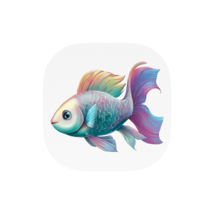
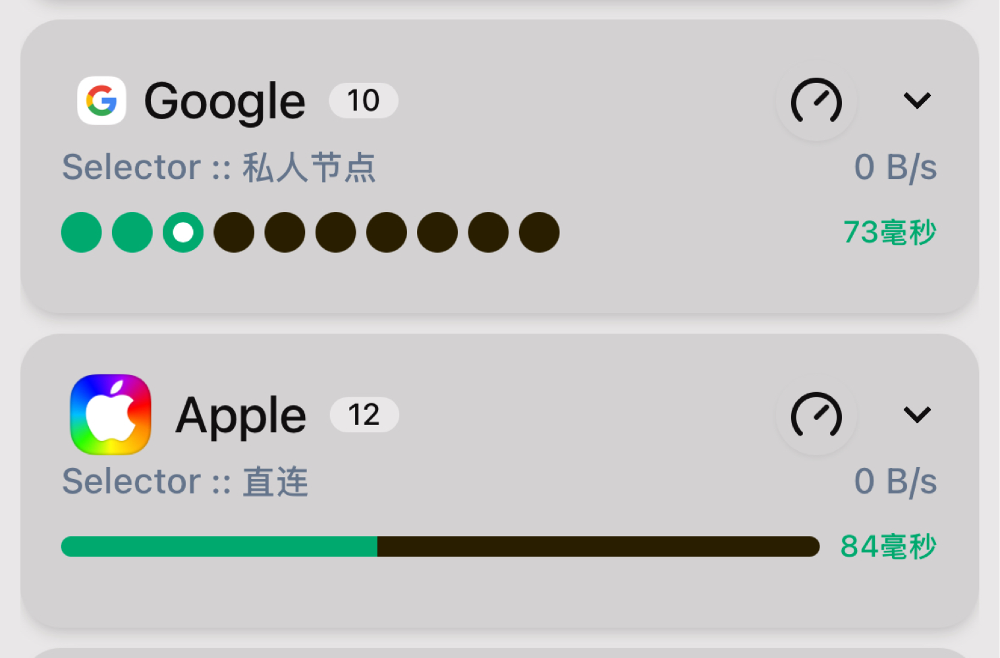

## 适用于mihomo - MetacubeX面板的Icon

# 使用前：

        需要了解编写规则配置(*.ymal)

        需要了解使用mihomo - MetacubeX面板
        

# 使用指南：

#### 1、Icons的命名本质上不和你的策略组相关联。

2、建议同步到本地，便于阅读

3、Icons地址请使用raw地址

        例如：https://raw.githubusercontent.com/Vbaethon/HOMOMIX/main/Icon/Color/China.png

4、部分网络环境需要借助镜像加速

        添加前缀：https://ghp.ci.com/
        
        例如：https://ghp.ci/https://raw.githubusercontent.com/Vbaethon/HOMOMIX/main/Icon/Color/China.png

5、面板可以调节尺寸与距离

# Icon版本：

        等高版本（默认设置下）
        满高版本（Color/Large）

<!--start-icons-->

<table style="width: 100%; text-align: center;"><tr>
    <td align="center" style="padding: 10px;">
         
        Adblock
    </td>
    <td align="center" style="padding: 10px;">
         
        AdblockPlu...
    </td>
    <td align="center" style="padding: 10px;">
         
        AdblockPlu...
    </td>
    <td align="center" style="padding: 10px;">
         
        Adguard
    </td>
    <td align="center" style="padding: 10px;">
         
        AI
    </td>
    <td align="center" style="padding: 10px;">
         
        AI_bot
    </td>
    <td align="center" style="padding: 10px;">
         
        AI_Tree
    </td></tr><tr>
    <td align="center" style="padding: 10px;">
         
        AI_voice
    </td>
    <td align="center" style="padding: 10px;">
         
        Amazon
    </td>
    <td align="center" style="padding: 10px;">
         
        Apple
    </td>
    <td align="center" style="padding: 10px;">
         
        Apple_blac...
    </td>
    <td align="center" style="padding: 10px;">
         
        Apple_rain...
    </td>
    <td align="center" style="padding: 10px;">
         
        Apple_TV
    </td>
    <td align="center" style="padding: 10px;">
         
        ASIA
    </td></tr><tr>
    <td align="center" style="padding: 10px;">
         
        Auto_Link
    </td>
    <td align="center" style="padding: 10px;">
         
        Bahamut
    </td>
    <td align="center" style="padding: 10px;">
         
        Bahamut_b
    </td>
    <td align="center" style="padding: 10px;">
         
        bilibili
    </td>
    <td align="center" style="padding: 10px;">
         
        Bilibili_b...
    </td>
    <td align="center" style="padding: 10px;">
         
        Bilibili_G...
    </td>
    <td align="center" style="padding: 10px;">
         
        Bing
    </td></tr><tr>
    <td align="center" style="padding: 10px;">
         
        Bluesky
    </td>
    <td align="center" style="padding: 10px;">
         
        BT_Bittorr...
    </td>
    <td align="center" style="padding: 10px;">
         
        Bytedance
    </td>
    <td align="center" style="padding: 10px;">
         
        Calcifer
    </td>
    <td align="center" style="padding: 10px;">
         
        Chained
    </td>
    <td align="center" style="padding: 10px;">
         
        Chained_2
    </td>
    <td align="center" style="padding: 10px;">
         
        ChatGPT
    </td></tr><tr>
    <td align="center" style="padding: 10px;">
         
        China
    </td>
    <td align="center" style="padding: 10px;">
         
        China_Taip...
    </td>
    <td align="center" style="padding: 10px;">
         
        Claud
    </td>
    <td align="center" style="padding: 10px;">
         
        Cloud
    </td>
    <td align="center" style="padding: 10px;">
         
        CloudFlare
    </td>
    <td align="center" style="padding: 10px;">
         
        Consistent...
    </td>
    <td align="center" style="padding: 10px;">
         
        Discord
    </td></tr><tr>
    <td align="center" style="padding: 10px;">
         
        Disney
    </td>
    <td align="center" style="padding: 10px;">
         
        Disney_Cas...
    </td>
    <td align="center" style="padding: 10px;">
         
        Disney_Cha...
    </td>
    <td align="center" style="padding: 10px;">
         
        Disney_Mic...
    </td>
    <td align="center" style="padding: 10px;">
         
        Disney_plu...
    </td>
    <td align="center" style="padding: 10px;">
         
        Dolphin
    </td>
    <td align="center" style="padding: 10px;">
         
        Douyin
    </td></tr><tr>
    <td align="center" style="padding: 10px;">
         
        Download
    </td>
    <td align="center" style="padding: 10px;">
         
        Download_2
    </td>
    <td align="center" style="padding: 10px;">
         
        Emby
    </td>
    <td align="center" style="padding: 10px;">
         
        EPIC
    </td>
    <td align="center" style="padding: 10px;">
         
        European_U...
    </td>
    <td align="center" style="padding: 10px;">
         
        F2C
    </td>
    <td align="center" style="padding: 10px;">
         
        Facebook
    </td></tr><tr>
    <td align="center" style="padding: 10px;">
         
        Failover
    </td>
    <td align="center" style="padding: 10px;">
         
        Fast
    </td>
    <td align="center" style="padding: 10px;">
         
        FCM_Fireba...
    </td>
    <td align="center" style="padding: 10px;">
         
        Fish
    </td>
    <td align="center" style="padding: 10px;">
         
        Fish_b
    </td>
    <td align="center" style="padding: 10px;">
         
        Fish_x
    </td>
    <td align="center" style="padding: 10px;">
         
        Flight
    </td></tr><tr>
    <td align="center" style="padding: 10px;">
         
        Forbidden
    </td>
    <td align="center" style="padding: 10px;">
         
        Game
    </td>
    <td align="center" style="padding: 10px;">
         
        GFW
    </td>
    <td align="center" style="padding: 10px;">
         
        GitHub
    </td>
    <td align="center" style="padding: 10px;">
         
        Global
    </td>
    <td align="center" style="padding: 10px;">
         
        Globefish
    </td>
    <td align="center" style="padding: 10px;">
         
        Gmail
    </td></tr><tr>
    <td align="center" style="padding: 10px;">
         
        GOG
    </td>
    <td align="center" style="padding: 10px;">
         
        Google
    </td>
    <td align="center" style="padding: 10px;">
         
        HBO_MAX
    </td>
    <td align="center" style="padding: 10px;">
         
        Home
    </td>
    <td align="center" style="padding: 10px;">
         
        Hong_Kong
    </td>
    <td align="center" style="padding: 10px;">
         
        Hugging_fa...
    </td>
    <td align="center" style="padding: 10px;">
         
        Hugging_fa...
    </td></tr><tr>
    <td align="center" style="padding: 10px;">
         
        Hulu
    </td>
    <td align="center" style="padding: 10px;">
         
        Infuse
    </td>
    <td align="center" style="padding: 10px;">
         
        Instagram
    </td>
    <td align="center" style="padding: 10px;">
         
        Japan
    </td>
    <td align="center" style="padding: 10px;">
         
        Jellyfin
    </td>
    <td align="center" style="padding: 10px;">
         
        Link
    </td>
    <td align="center" style="padding: 10px;">
         
        Linkedin
    </td></tr><tr>
    <td align="center" style="padding: 10px;">
         
        Linkedin_r...
    </td>
    <td align="center" style="padding: 10px;">
         
        Load_balan...
    </td>
    <td align="center" style="padding: 10px;">
         
        Load_balan...
    </td>
    <td align="center" style="padding: 10px;">
         
        Load_balan...
    </td>
    <td align="center" style="padding: 10px;">
         
        Location
    </td>
    <td align="center" style="padding: 10px;">
         
        Magic_Time...
    </td>
    <td align="center" style="padding: 10px;">
         
        Mail
    </td></tr><tr>
    <td align="center" style="padding: 10px;">
         
        Messenger
    </td>
    <td align="center" style="padding: 10px;">
         
        Meta_1
    </td>
    <td align="center" style="padding: 10px;">
         
        Microsoft
    </td>
    <td align="center" style="padding: 10px;">
         
        Microsoft_...
    </td>
    <td align="center" style="padding: 10px;">
         
        Microsoft_...
    </td>
    <td align="center" style="padding: 10px;">
         
        MLB
    </td>
    <td align="center" style="padding: 10px;">
         
        NBA
    </td></tr><tr>
    <td align="center" style="padding: 10px;">
         
        Netflix
    </td>
    <td align="center" style="padding: 10px;">
         
        Netflix_b
    </td>
    <td align="center" style="padding: 10px;">
         
        Network
    </td>
    <td align="center" style="padding: 10px;">
         
        Network_2
    </td>
    <td align="center" style="padding: 10px;">
         
        Niche_Link
    </td>
    <td align="center" style="padding: 10px;">
         
        Olympics
    </td>
    <td align="center" style="padding: 10px;">
         
        Omission
    </td></tr><tr>
    <td align="center" style="padding: 10px;">
         
        OneDrive
    </td>
    <td align="center" style="padding: 10px;">
         
        Onlyfans
    </td>
    <td align="center" style="padding: 10px;">
         
        Other
    </td>
    <td align="center" style="padding: 10px;">
         
        Outlook
    </td>
    <td align="center" style="padding: 10px;">
         
        Palestine
    </td>
    <td align="center" style="padding: 10px;">
         
        Panda
    </td>
    <td align="center" style="padding: 10px;">
         
        Panda_ai
    </td></tr><tr>
    <td align="center" style="padding: 10px;">
         
        Panda_WWF
    </td>
    <td align="center" style="padding: 10px;">
         
        PayPal
    </td>
    <td align="center" style="padding: 10px;">
         
        PayPal_bus...
    </td>
    <td align="center" style="padding: 10px;">
         
        Peacook
    </td>
    <td align="center" style="padding: 10px;">
         
        Perplexity
    </td>
    <td align="center" style="padding: 10px;">
         
        Pig
    </td>
    <td align="center" style="padding: 10px;">
         
        Piggies
    </td></tr><tr>
    <td align="center" style="padding: 10px;">
         
        Pixiv
    </td>
    <td align="center" style="padding: 10px;">
         
        Playstatio...
    </td>
    <td align="center" style="padding: 10px;">
         
        Playstatio...
    </td>
    <td align="center" style="padding: 10px;">
         
        Playstatio...
    </td>
    <td align="center" style="padding: 10px;">
         
        Plex
    </td>
    <td align="center" style="padding: 10px;">
         
        Pornhub
    </td>
    <td align="center" style="padding: 10px;">
         
        Prime
    </td></tr><tr>
    <td align="center" style="padding: 10px;">
         
        Qoura
    </td>
    <td align="center" style="padding: 10px;">
         
        Reddit
    </td>
    <td align="center" style="padding: 10px;">
         
        Remote
    </td>
    <td align="center" style="padding: 10px;">
         
        Round_Robi...
    </td>
    <td align="center" style="padding: 10px;">
         
        Scholar
    </td>
    <td align="center" style="padding: 10px;">
         
        Seancody
    </td>
    <td align="center" style="padding: 10px;">
         
        Server
    </td></tr><tr>
    <td align="center" style="padding: 10px;">
         
        Settings
    </td>
    <td align="center" style="padding: 10px;">
         
        Signal_Lig...
    </td>
    <td align="center" style="padding: 10px;">
         
        Singapore
    </td>
    <td align="center" style="padding: 10px;">
         
        SNS
    </td>
    <td align="center" style="padding: 10px;">
         
        Sony_Live
    </td>
    <td align="center" style="padding: 10px;">
         
        South_Kore...
    </td>
    <td align="center" style="padding: 10px;">
         
        SpeedTest
    </td></tr><tr>
    <td align="center" style="padding: 10px;">
         
        Spotify
    </td>
    <td align="center" style="padding: 10px;">
         
        Steam
    </td>
    <td align="center" style="padding: 10px;">
         
        Stream
    </td>
    <td align="center" style="padding: 10px;">
         
        Taiwan_Pro...
    </td>
    <td align="center" style="padding: 10px;">
         
        Telegram
    </td>
    <td align="center" style="padding: 10px;">
         
        Threads
    </td>
    <td align="center" style="padding: 10px;">
         
        Tick
    </td></tr><tr>
    <td align="center" style="padding: 10px;">
         
        Tick_2
    </td>
    <td align="center" style="padding: 10px;">
         
        TikTok
    </td>
    <td align="center" style="padding: 10px;">
         
        Transfer
    </td>
    <td align="center" style="padding: 10px;">
         
        Twitch
    </td>
    <td align="center" style="padding: 10px;">
         
        Twitter
    </td>
    <td align="center" style="padding: 10px;">
         
        UBISOFT
    </td>
    <td align="center" style="padding: 10px;">
         
        UK
    </td></tr><tr>
    <td align="center" style="padding: 10px;">
         
        USA
    </td>
    <td align="center" style="padding: 10px;">
         
        Weibo
    </td>
    <td align="center" style="padding: 10px;">
         
        WhatsApp
    </td>
    <td align="center" style="padding: 10px;">
         
        X
    </td>
    <td align="center" style="padding: 10px;">
         
        Xbox
    </td>
    <td align="center" style="padding: 10px;">
         
        xHamster
    </td>
    <td align="center" style="padding: 10px;">
         
        Yin_Yang
    </td></tr><tr>
    <td align="center" style="padding: 10px;">
         
        YouTube
    </td>
    <td align="center" style="padding: 10px;">
         
        Zoho_new
    </td>
    <td align="center" style="padding: 10px;">
         
        Zoho_old
    </td>
    <td align="center" style="padding: 10px;">
         
        Zune
    </td></tr></table>

<!--end-icons-->

## 效果

| 大小对比（手机截图） |
|---|
|  |
