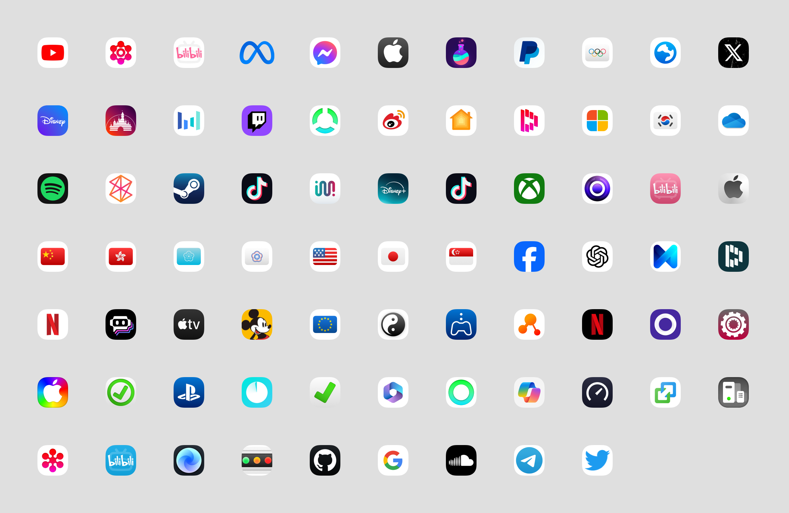

## 适用于mihomo - MetacubeX面板的Icon

# 使用前：

        使用本仓库内容需要了解一些简单的yaml文件编写。

        如果你不知道什么是mihomo - MetacubeX面板，那就可以跳过此仓库了

        需要面板版本：1.15+

# Icon目前包含了：

        等高版本（默认设置）
        大尺寸版本（Color/Large） 

### 部分图标展示

# 使用指南：

#### 1、Icon的命名不会对应你任何你配置文件中的的命名。请根据自己的感觉和理解随性使用Icon，不用被Icon的命名束缚了你的思想。

2、建议同步到本地，这样你可以更直观的知道需要使用什么。

3、Icon地址请使用原始地址，也就是raw开头的地址。

        例如：https://raw.githubusercontent.com/Vbaethon/HOMOMIX/main/Icon/Color/China.png

4、部分网络环境需要借助镜像加速。

        解决办法：在原始地址前加入：https://mirror.ghproxy.com/原始地址
        
        例如：https://mirror.ghproxy.com/https://raw.githubusercontent.com/Vbaethon/HOMOMIX/main/Icon/Color/China.png

5、可以通过面板设置调整大小和间距

## 效果

| 电脑端面板 |
|---|
|  |

| 大小对比（手机截图） |
|---|
|  |

## 图标展示

| 图标名称  | 预览    |
| -------- | -------- |
| Server.png |  |
| TikTok.png |  |
| Hulu.png |  |
| Chained.png |  |
| Playstation_remote.png |  |
| Game.png |  |
| Disney_plus.png |  |
| Taiwan_Province.png |  |
| Microsoft.png |  |
| Zune.png |  |
| Download_2.png |  |
| Jellyfin.png |  |
| Adblock.png |  |
| Messenger.png |  |
| Transfer.png |  |
| Microsoft_Copilot.png |  |
| Chained_2.png |  |
| FCM_Firebase_Cloud_Messaging.png |  |
| Apple.png |  |
| Cloud.png |  |
| Consistent_Hashing.png |  |
| Linkedin.png |  |
| bilibili.png |  |
| Link.png |  |
| Location.png |  |
| Home.png |  |
| Failover.png |  |
| Settings.png |  |
| Fast.png |  |
| Tick_2.png |  |
| Netflix_b.png |  |
| Playstation_2.png |  |
| Microsoft_365.png |  |
| Niche_Link.png |  |
| Flight.png |  |
| Prime.png |  |
| Auto_Link.png |  |
| Panda_WWF.png |  |
| Singapore.png |  |
| AdblockPlus_2.png |  |
| Infuse.png |  |
| Plex.png |  |
| Disney_Mickey.png |  |
| Japan.png |  |
| Dolphin.png |  |
| Zoho_old.png |  |
| Disney.png |  |
| X.png |  |
| Load_balancing_2.png |  |
| Telegram.png |  |
| Emby.png |  |
| PayPal_business.png |  |
| Disney_Castle.png |  |
| Round_Robin.png |  |
| South_Korea.png |  |
| BT_Bittorrent.png |  |
| Calcifer.png |  |
| Google.png |  |
| Apple_TV.png |  |
| Pornhub.png |  |
| Bytedance.png |  |
| Meta.png |  |
| Meta_1.png |  |
| Weibo.png |  |
| YouTube.png |  |
| Steam.png |  |
| GitHub.png |  |
| Zoho_new.png |  |
| AI.png |  |
| Twitch.png |  |
| Olympics.png |  |
| Network.png |  |
| Netflix.png |  |
| Spotify.png |  |
| Forbidden.png |  |
| Yin_Yang.png |  |
| Twitter.png |  |
| Palestine.png |  |
| Panda_ai.png |  |
| Xbox.png |  |
| xHamster.png |  |
| Magic_Timer.png |  |
| SpeedTest.png |  |
| Remote.png |  |
| Seancody.png |  |
| Bilibili_blue.png |  |
| Fish.png |  |
| ChatGPT.png |  |
| AdblockPlus.png |  |
| Linkedin_ray.png |  |
| European_Union.png |  |
| Apple_black.png |  |
| Download.png |  |
| Onlyfans.png |  |
| Facebook.png |  |
| Other.png |  |
| Adguard.png |  |
| Panda.png |  |
| Load_balancing_3.png |  |
| Bilibili_Global.png |  |
| Hong_Kong.png |  |
| Disney_Channel.png |  |
| Global.png |  |
| Sony_Live.png |  |
| OneDrive.png |  |
| Signal_Light.png |  |
| PayPal.png |  |
| USA.png |  |
| Network_2.png |  |
| China.png |  |
| China_Taipei.png |  |
| Playstation.png |  |
| Load_balancing.png |  |
| UK.png |  |
| Apple_rainbow.png |  |
| Tick.png |  |
| Douyin.png |  |
| Omission.png |  |

## Preview

<table><tr>
        <td align="center" style="padding: 10px;">
             
            <b>Server.png</b>
        </td>
        <td align="center" style="padding: 10px;">
             
            <b>TikTok.png</b>
        </td>
        <td align="center" style="padding: 10px;">
             
            <b>Hulu.png</b>
        </td>
        <td align="center" style="padding: 10px;">
             
            <b>Chained.png</b>
        </td></tr><tr>
        <td align="center" style="padding: 10px;">
             
            <b>Playstation_remote.png</b>
        </td>
        <td align="center" style="padding: 10px;">
             
            <b>Game.png</b>
        </td>
        <td align="center" style="padding: 10px;">
             
            <b>Disney_plus.png</b>
        </td>
        <td align="center" style="padding: 10px;">
             
            <b>Taiwan_Province.png</b>
        </td></tr><tr>
        <td align="center" style="padding: 10px;">
             
            <b>Microsoft.png</b>
        </td>
        <td align="center" style="padding: 10px;">
             
            <b>Zune.png</b>
        </td>
        <td align="center" style="padding: 10px;">
             
            <b>Download_2.png</b>
        </td>
        <td align="center" style="padding: 10px;">
             
            <b>Jellyfin.png</b>
        </td></tr><tr>
        <td align="center" style="padding: 10px;">
             
            <b>Adblock.png</b>
        </td>
        <td align="center" style="padding: 10px;">
             
            <b>Messenger.png</b>
        </td>
        <td align="center" style="padding: 10px;">
             
            <b>Transfer.png</b>
        </td>
        <td align="center" style="padding: 10px;">
             
            <b>Microsoft_Copilot.png</b>
        </td></tr><tr>
        <td align="center" style="padding: 10px;">
             
            <b>Chained_2.png</b>
        </td>
        <td align="center" style="padding: 10px;">
             
            <b>FCM_Firebase_Cloud_Messaging.png</b>
        </td>
        <td align="center" style="padding: 10px;">
             
            <b>Apple.png</b>
        </td>
        <td align="center" style="padding: 10px;">
             
            <b>Cloud.png</b>
        </td></tr><tr>
        <td align="center" style="padding: 10px;">
             
            <b>Consistent_Hashing.png</b>
        </td>
        <td align="center" style="padding: 10px;">
             
            <b>Linkedin.png</b>
        </td>
        <td align="center" style="padding: 10px;">
             
            <b>bilibili.png</b>
        </td>
        <td align="center" style="padding: 10px;">
             
            <b>Link.png</b>
        </td></tr><tr>
        <td align="center" style="padding: 10px;">
             
            <b>Location.png</b>
        </td>
        <td align="center" style="padding: 10px;">
             
            <b>Home.png</b>
        </td>
        <td align="center" style="padding: 10px;">
             
            <b>Failover.png</b>
        </td>
        <td align="center" style="padding: 10px;">
             
            <b>Settings.png</b>
        </td></tr><tr>
        <td align="center" style="padding: 10px;">
             
            <b>Fast.png</b>
        </td>
        <td align="center" style="padding: 10px;">
             
            <b>Tick_2.png</b>
        </td>
        <td align="center" style="padding: 10px;">
             
            <b>Netflix_b.png</b>
        </td>
        <td align="center" style="padding: 10px;">
             
            <b>Playstation_2.png</b>
        </td></tr><tr>
        <td align="center" style="padding: 10px;">
             
            <b>Microsoft_365.png</b>
        </td>
        <td align="center" style="padding: 10px;">
             
            <b>Niche_Link.png</b>
        </td>
        <td align="center" style="padding: 10px;">
             
            <b>Flight.png</b>
        </td>
        <td align="center" style="padding: 10px;">
             
            <b>Prime.png</b>
        </td></tr><tr>
        <td align="center" style="padding: 10px;">
             
            <b>Auto_Link.png</b>
        </td>
        <td align="center" style="padding: 10px;">
             
            <b>Panda_WWF.png</b>
        </td>
        <td align="center" style="padding: 10px;">
             
            <b>Singapore.png</b>
        </td>
        <td align="center" style="padding: 10px;">
             
            <b>AdblockPlus_2.png</b>
        </td></tr><tr>
        <td align="center" style="padding: 10px;">
             
            <b>Infuse.png</b>
        </td>
        <td align="center" style="padding: 10px;">
             
            <b>Plex.png</b>
        </td>
        <td align="center" style="padding: 10px;">
             
            <b>Disney_Mickey.png</b>
        </td>
        <td align="center" style="padding: 10px;">
             
            <b>Japan.png</b>
        </td></tr><tr>
        <td align="center" style="padding: 10px;">
             
            <b>Dolphin.png</b>
        </td>
        <td align="center" style="padding: 10px;">
             
            <b>Zoho_old.png</b>
        </td>
        <td align="center" style="padding: 10px;">
             
            <b>Disney.png</b>
        </td>
        <td align="center" style="padding: 10px;">
             
            <b>X.png</b>
        </td></tr><tr>
        <td align="center" style="padding: 10px;">
             
            <b>Load_balancing_2.png</b>
        </td>
        <td align="center" style="padding: 10px;">
             
            <b>Telegram.png</b>
        </td>
        <td align="center" style="padding: 10px;">
             
            <b>Emby.png</b>
        </td>
        <td align="center" style="padding: 10px;">
             
            <b>PayPal_business.png</b>
        </td></tr><tr>
        <td align="center" style="padding: 10px;">
             
            <b>Disney_Castle.png</b>
        </td>
        <td align="center" style="padding: 10px;">
             
            <b>Round_Robin.png</b>
        </td>
        <td align="center" style="padding: 10px;">
             
            <b>South_Korea.png</b>
        </td>
        <td align="center" style="padding: 10px;">
             
            <b>BT_Bittorrent.png</b>
        </td></tr><tr>
        <td align="center" style="padding: 10px;">
             
            <b>Calcifer.png</b>
        </td>
        <td align="center" style="padding: 10px;">
             
            <b>Google.png</b>
        </td>
        <td align="center" style="padding: 10px;">
             
            <b>Apple_TV.png</b>
        </td>
        <td align="center" style="padding: 10px;">
             
            <b>Pornhub.png</b>
        </td></tr><tr>
        <td align="center" style="padding: 10px;">
             
            <b>Bytedance.png</b>
        </td>
        <td align="center" style="padding: 10px;">
             
            <b>Meta.png</b>
        </td>
        <td align="center" style="padding: 10px;">
             
            <b>Meta_1.png</b>
        </td>
        <td align="center" style="padding: 10px;">
             
            <b>Weibo.png</b>
        </td></tr><tr>
        <td align="center" style="padding: 10px;">
             
            <b>YouTube.png</b>
        </td>
        <td align="center" style="padding: 10px;">
             
            <b>Steam.png</b>
        </td>
        <td align="center" style="padding: 10px;">
             
            <b>GitHub.png</b>
        </td>
        <td align="center" style="padding: 10px;">
             
            <b>Zoho_new.png</b>
        </td></tr><tr>
        <td align="center" style="padding: 10px;">
             
            <b>AI.png</b>
        </td>
        <td align="center" style="padding: 10px;">
             
            <b>Twitch.png</b>
        </td>
        <td align="center" style="padding: 10px;">
             
            <b>Olympics.png</b>
        </td>
        <td align="center" style="padding: 10px;">
             
            <b>Network.png</b>
        </td></tr><tr>
        <td align="center" style="padding: 10px;">
             
            <b>Netflix.png</b>
        </td>
        <td align="center" style="padding: 10px;">
             
            <b>Spotify.png</b>
        </td>
        <td align="center" style="padding: 10px;">
             
            <b>Forbidden.png</b>
        </td>
        <td align="center" style="padding: 10px;">
             
            <b>Yin_Yang.png</b>
        </td></tr><tr>
        <td align="center" style="padding: 10px;">
             
            <b>Twitter.png</b>
        </td>
        <td align="center" style="padding: 10px;">
             
            <b>Palestine.png</b>
        </td>
        <td align="center" style="padding: 10px;">
             
            <b>Panda_ai.png</b>
        </td>
        <td align="center" style="padding: 10px;">
             
            <b>Xbox.png</b>
        </td></tr><tr>
        <td align="center" style="padding: 10px;">
             
            <b>xHamster.png</b>
        </td>
        <td align="center" style="padding: 10px;">
             
            <b>Magic_Timer.png</b>
        </td>
        <td align="center" style="padding: 10px;">
             
            <b>SpeedTest.png</b>
        </td>
        <td align="center" style="padding: 10px;">
             
            <b>Remote.png</b>
        </td></tr><tr>
        <td align="center" style="padding: 10px;">
             
            <b>Seancody.png</b>
        </td>
        <td align="center" style="padding: 10px;">
             
            <b>Bilibili_blue.png</b>
        </td>
        <td align="center" style="padding: 10px;">
             
            <b>Fish.png</b>
        </td>
        <td align="center" style="padding: 10px;">
             
            <b>ChatGPT.png</b>
        </td></tr><tr>
        <td align="center" style="padding: 10px;">
             
            <b>AdblockPlus.png</b>
        </td>
        <td align="center" style="padding: 10px;">
             
            <b>Linkedin_ray.png</b>
        </td>
        <td align="center" style="padding: 10px;">
             
            <b>European_Union.png</b>
        </td>
        <td align="center" style="padding: 10px;">
             
            <b>Apple_black.png</b>
        </td></tr><tr>
        <td align="center" style="padding: 10px;">
             
            <b>Download.png</b>
        </td>
        <td align="center" style="padding: 10px;">
             
            <b>Onlyfans.png</b>
        </td>
        <td align="center" style="padding: 10px;">
             
            <b>Facebook.png</b>
        </td>
        <td align="center" style="padding: 10px;">
             
            <b>Other.png</b>
        </td></tr><tr>
        <td align="center" style="padding: 10px;">
             
            <b>Adguard.png</b>
        </td>
        <td align="center" style="padding: 10px;">
             
            <b>Panda.png</b>
        </td>
        <td align="center" style="padding: 10px;">
             
            <b>Load_balancing_3.png</b>
        </td>
        <td align="center" style="padding: 10px;">
             
            <b>Bilibili_Global.png</b>
        </td></tr><tr>
        <td align="center" style="padding: 10px;">
             
            <b>Hong_Kong.png</b>
        </td>
        <td align="center" style="padding: 10px;">
             
            <b>Disney_Channel.png</b>
        </td>
        <td align="center" style="padding: 10px;">
             
            <b>Global.png</b>
        </td>
        <td align="center" style="padding: 10px;">
             
            <b>Sony_Live.png</b>
        </td></tr><tr>
        <td align="center" style="padding: 10px;">
             
            <b>OneDrive.png</b>
        </td>
        <td align="center" style="padding: 10px;">
             
            <b>Signal_Light.png</b>
        </td>
        <td align="center" style="padding: 10px;">
             
            <b>PayPal.png</b>
        </td>
        <td align="center" style="padding: 10px;">
             
            <b>USA.png</b>
        </td></tr><tr>
        <td align="center" style="padding: 10px;">
             
            <b>Network_2.png</b>
        </td>
        <td align="center" style="padding: 10px;">
             
            <b>China.png</b>
        </td>
        <td align="center" style="padding: 10px;">
             
            <b>China_Taipei.png</b>
        </td>
        <td align="center" style="padding: 10px;">
             
            <b>Playstation.png</b>
        </td></tr><tr>
        <td align="center" style="padding: 10px;">
             
            <b>Load_balancing.png</b>
        </td>
        <td align="center" style="padding: 10px;">
             
            <b>UK.png</b>
        </td>
        <td align="center" style="padding: 10px;">
             
            <b>Apple_rainbow.png</b>
        </td>
        <td align="center" style="padding: 10px;">
             
            <b>Tick.png</b>
        </td></tr><tr>
        <td align="center" style="padding: 10px;">
             
            <b>Douyin.png</b>
        </td>
        <td align="center" style="padding: 10px;">
             
            <b>Omission.png</b>
        </td></tr></table>

## Preview

<table><tr>
        <td align="center" style="padding: 10px;">
             
            <b>Server.png</b>
        </td>
        <td align="center" style="padding: 10px;">
             
            <b>TikTok.png</b>
        </td>
        <td align="center" style="padding: 10px;">
             
            <b>Hulu.png</b>
        </td>
        <td align="center" style="padding: 10px;">
             
            <b>Chained.png</b>
        </td></tr><tr>
        <td align="center" style="padding: 10px;">
             
            <b>Playstation_remote.png</b>
        </td>
        <td align="center" style="padding: 10px;">
             
            <b>Game.png</b>
        </td>
        <td align="center" style="padding: 10px;">
             
            <b>Disney_plus.png</b>
        </td>
        <td align="center" style="padding: 10px;">
             
            <b>Taiwan_Province.png</b>
        </td></tr><tr>
        <td align="center" style="padding: 10px;">
             
            <b>Microsoft.png</b>
        </td>
        <td align="center" style="padding: 10px;">
             
            <b>Zune.png</b>
        </td>
        <td align="center" style="padding: 10px;">
             
            <b>Download_2.png</b>
        </td>
        <td align="center" style="padding: 10px;">
             
            <b>Jellyfin.png</b>
        </td></tr><tr>
        <td align="center" style="padding: 10px;">
             
            <b>Adblock.png</b>
        </td>
        <td align="center" style="padding: 10px;">
             
            <b>Messenger.png</b>
        </td>
        <td align="center" style="padding: 10px;">
             
            <b>Transfer.png</b>
        </td>
        <td align="center" style="padding: 10px;">
             
            <b>Microsoft_Copilot.png</b>
        </td></tr><tr>
        <td align="center" style="padding: 10px;">
             
            <b>Chained_2.png</b>
        </td>
        <td align="center" style="padding: 10px;">
             
            <b>FCM_Firebase_Cloud_Messaging.png</b>
        </td>
        <td align="center" style="padding: 10px;">
             
            <b>Apple.png</b>
        </td>
        <td align="center" style="padding: 10px;">
             
            <b>Cloud.png</b>
        </td></tr><tr>
        <td align="center" style="padding: 10px;">
             
            <b>Consistent_Hashing.png</b>
        </td>
        <td align="center" style="padding: 10px;">
             
            <b>Linkedin.png</b>
        </td>
        <td align="center" style="padding: 10px;">
             
            <b>bilibili.png</b>
        </td>
        <td align="center" style="padding: 10px;">
             
            <b>Link.png</b>
        </td></tr><tr>
        <td align="center" style="padding: 10px;">
             
            <b>Location.png</b>
        </td>
        <td align="center" style="padding: 10px;">
             
            <b>Home.png</b>
        </td>
        <td align="center" style="padding: 10px;">
             
            <b>Failover.png</b>
        </td>
        <td align="center" style="padding: 10px;">
             
            <b>Settings.png</b>
        </td></tr><tr>
        <td align="center" style="padding: 10px;">
             
            <b>Fast.png</b>
        </td>
        <td align="center" style="padding: 10px;">
             
            <b>Tick_2.png</b>
        </td>
        <td align="center" style="padding: 10px;">
             
            <b>Netflix_b.png</b>
        </td>
        <td align="center" style="padding: 10px;">
             
            <b>Playstation_2.png</b>
        </td></tr><tr>
        <td align="center" style="padding: 10px;">
             
            <b>Microsoft_365.png</b>
        </td>
        <td align="center" style="padding: 10px;">
             
            <b>Niche_Link.png</b>
        </td>
        <td align="center" style="padding: 10px;">
             
            <b>Flight.png</b>
        </td>
        <td align="center" style="padding: 10px;">
             
            <b>Prime.png</b>
        </td></tr><tr>
        <td align="center" style="padding: 10px;">
             
            <b>Auto_Link.png</b>
        </td>
        <td align="center" style="padding: 10px;">
             
            <b>Panda_WWF.png</b>
        </td>
        <td align="center" style="padding: 10px;">
             
            <b>Singapore.png</b>
        </td>
        <td align="center" style="padding: 10px;">
             
            <b>AdblockPlus_2.png</b>
        </td></tr><tr>
        <td align="center" style="padding: 10px;">
             
            <b>Infuse.png</b>
        </td>
        <td align="center" style="padding: 10px;">
             
            <b>Plex.png</b>
        </td>
        <td align="center" style="padding: 10px;">
             
            <b>Disney_Mickey.png</b>
        </td>
        <td align="center" style="padding: 10px;">
             
            <b>Japan.png</b>
        </td></tr><tr>
        <td align="center" style="padding: 10px;">
             
            <b>Dolphin.png</b>
        </td>
        <td align="center" style="padding: 10px;">
             
            <b>Zoho_old.png</b>
        </td>
        <td align="center" style="padding: 10px;">
             
            <b>Disney.png</b>
        </td>
        <td align="center" style="padding: 10px;">
             
            <b>X.png</b>
        </td></tr><tr>
        <td align="center" style="padding: 10px;">
             
            <b>Load_balancing_2.png</b>
        </td>
        <td align="center" style="padding: 10px;">
             
            <b>Telegram.png</b>
        </td>
        <td align="center" style="padding: 10px;">
             
            <b>Emby.png</b>
        </td>
        <td align="center" style="padding: 10px;">
             
            <b>PayPal_business.png</b>
        </td></tr><tr>
        <td align="center" style="padding: 10px;">
             
            <b>Disney_Castle.png</b>
        </td>
        <td align="center" style="padding: 10px;">
             
            <b>Round_Robin.png</b>
        </td>
        <td align="center" style="padding: 10px;">
             
            <b>South_Korea.png</b>
        </td>
        <td align="center" style="padding: 10px;">
             
            <b>BT_Bittorrent.png</b>
        </td></tr><tr>
        <td align="center" style="padding: 10px;">
             
            <b>Calcifer.png</b>
        </td>
        <td align="center" style="padding: 10px;">
             
            <b>Google.png</b>
        </td>
        <td align="center" style="padding: 10px;">
             
            <b>Apple_TV.png</b>
        </td>
        <td align="center" style="padding: 10px;">
             
            <b>Pornhub.png</b>
        </td></tr><tr>
        <td align="center" style="padding: 10px;">
             
            <b>Bytedance.png</b>
        </td>
        <td align="center" style="padding: 10px;">
             
            <b>Meta.png</b>
        </td>
        <td align="center" style="padding: 10px;">
             
            <b>Meta_1.png</b>
        </td>
        <td align="center" style="padding: 10px;">
             
            <b>Weibo.png</b>
        </td></tr><tr>
        <td align="center" style="padding: 10px;">
             
            <b>YouTube.png</b>
        </td>
        <td align="center" style="padding: 10px;">
             
            <b>Steam.png</b>
        </td>
        <td align="center" style="padding: 10px;">
             
            <b>GitHub.png</b>
        </td>
        <td align="center" style="padding: 10px;">
             
            <b>Zoho_new.png</b>
        </td></tr><tr>
        <td align="center" style="padding: 10px;">
             
            <b>AI.png</b>
        </td>
        <td align="center" style="padding: 10px;">
             
            <b>Twitch.png</b>
        </td>
        <td align="center" style="padding: 10px;">
             
            <b>Olympics.png</b>
        </td>
        <td align="center" style="padding: 10px;">
             
            <b>Network.png</b>
        </td></tr><tr>
        <td align="center" style="padding: 10px;">
             
            <b>Netflix.png</b>
        </td>
        <td align="center" style="padding: 10px;">
             
            <b>Spotify.png</b>
        </td>
        <td align="center" style="padding: 10px;">
             
            <b>Forbidden.png</b>
        </td>
        <td align="center" style="padding: 10px;">
             
            <b>Yin_Yang.png</b>
        </td></tr><tr>
        <td align="center" style="padding: 10px;">
             
            <b>Twitter.png</b>
        </td>
        <td align="center" style="padding: 10px;">
             
            <b>Palestine.png</b>
        </td>
        <td align="center" style="padding: 10px;">
             
            <b>Panda_ai.png</b>
        </td>
        <td align="center" style="padding: 10px;">
             
            <b>Xbox.png</b>
        </td></tr><tr>
        <td align="center" style="padding: 10px;">
             
            <b>xHamster.png</b>
        </td>
        <td align="center" style="padding: 10px;">
             
            <b>Magic_Timer.png</b>
        </td>
        <td align="center" style="padding: 10px;">
             
            <b>SpeedTest.png</b>
        </td>
        <td align="center" style="padding: 10px;">
             
            <b>Remote.png</b>
        </td></tr><tr>
        <td align="center" style="padding: 10px;">
             
            <b>Seancody.png</b>
        </td>
        <td align="center" style="padding: 10px;">
             
            <b>Bilibili_blue.png</b>
        </td>
        <td align="center" style="padding: 10px;">
             
            <b>Fish.png</b>
        </td>
        <td align="center" style="padding: 10px;">
             
            <b>ChatGPT.png</b>
        </td></tr><tr>
        <td align="center" style="padding: 10px;">
             
            <b>AdblockPlus.png</b>
        </td>
        <td align="center" style="padding: 10px;">
             
            <b>Linkedin_ray.png</b>
        </td>
        <td align="center" style="padding: 10px;">
             
            <b>European_Union.png</b>
        </td>
        <td align="center" style="padding: 10px;">
             
            <b>Apple_black.png</b>
        </td></tr><tr>
        <td align="center" style="padding: 10px;">
             
            <b>Download.png</b>
        </td>
        <td align="center" style="padding: 10px;">
             
            <b>Onlyfans.png</b>
        </td>
        <td align="center" style="padding: 10px;">
             
            <b>Facebook.png</b>
        </td>
        <td align="center" style="padding: 10px;">
             
            <b>Other.png</b>
        </td></tr><tr>
        <td align="center" style="padding: 10px;">
             
            <b>Adguard.png</b>
        </td>
        <td align="center" style="padding: 10px;">
             
            <b>Panda.png</b>
        </td>
        <td align="center" style="padding: 10px;">
             
            <b>Load_balancing_3.png</b>
        </td>
        <td align="center" style="padding: 10px;">
             
            <b>Bilibili_Global.png</b>
        </td></tr><tr>
        <td align="center" style="padding: 10px;">
             
            <b>Hong_Kong.png</b>
        </td>
        <td align="center" style="padding: 10px;">
             
            <b>Disney_Channel.png</b>
        </td>
        <td align="center" style="padding: 10px;">
             
            <b>Global.png</b>
        </td>
        <td align="center" style="padding: 10px;">
             
            <b>Sony_Live.png</b>
        </td></tr><tr>
        <td align="center" style="padding: 10px;">
             
            <b>OneDrive.png</b>
        </td>
        <td align="center" style="padding: 10px;">
             
            <b>Signal_Light.png</b>
        </td>
        <td align="center" style="padding: 10px;">
             
            <b>PayPal.png</b>
        </td>
        <td align="center" style="padding: 10px;">
             
            <b>USA.png</b>
        </td></tr><tr>
        <td align="center" style="padding: 10px;">
             
            <b>Network_2.png</b>
        </td>
        <td align="center" style="padding: 10px;">
             
            <b>China.png</b>
        </td>
        <td align="center" style="padding: 10px;">
             
            <b>China_Taipei.png</b>
        </td>
        <td align="center" style="padding: 10px;">
             
            <b>Playstation.png</b>
        </td></tr><tr>
        <td align="center" style="padding: 10px;">
             
            <b>Load_balancing.png</b>
        </td>
        <td align="center" style="padding: 10px;">
             
            <b>UK.png</b>
        </td>
        <td align="center" style="padding: 10px;">
             
            <b>Apple_rainbow.png</b>
        </td>
        <td align="center" style="padding: 10px;">
             
            <b>Tick.png</b>
        </td></tr><tr>
        <td align="center" style="padding: 10px;">
             
            <b>Douyin.png</b>
        </td>
        <td align="center" style="padding: 10px;">
             
            <b>Omission.png</b>
        </td></tr></table>